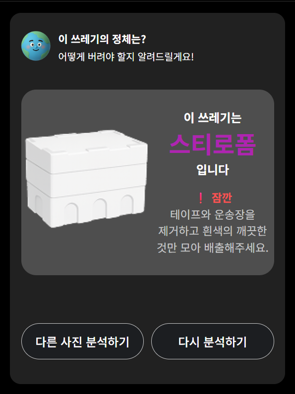
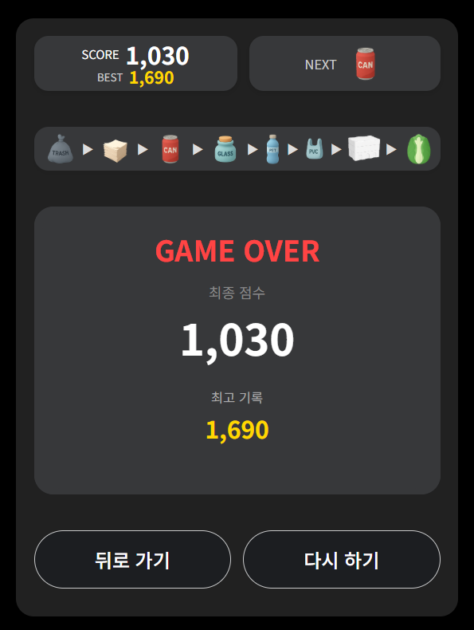
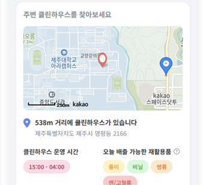
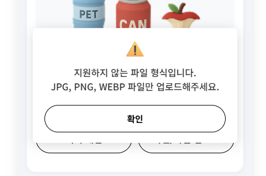

# 버릴까 말까 - AI를 이용한 분리수거 도우미 서비스

## 목차

1. [프로젝트 소개](#프로젝트-소개)
2. [팀원 소개](#팀원-소개)
3. [기술 스택](#기술-스택)
4. [협업 및 기획](#협업-및-기획)
5. [주요 기능](#주요-기능)
   - [AI 기반 분리수거 가이드](#1-ai-기반-분리수거-가이드)
   - [분리수거 미니 게임](#2-분리수거-미니-게임)
   - [위치 기반 클린하우스 안내](#4-위치-기반-클린하우스-안내)
6. [실행 화면](#실행-화면)
7. [핵심 코드](#핵심-코드)
   - [이미지 유효성 검사](#이미지-유효성-검사-및-프리뷰)
   - [3D 지구 로딩 애니메이션](#3d-지구-로딩-애니메이션)
   - [데이터 캐싱 시스템](#데이터-캐싱-시스템)
8. [프로젝트 구조](#프로젝트-구조)
9. [설치 및 실행 방법](#설치-및-실행-방법)

## 프로젝트 소개
사람들이 일상생활에서 헷갈려 하는 분리수거 방법을 쉽고 재미있게 배울 수 있도록 돕는 웹 애플리케이션입니다. <br>
이는 단순한 정보 제공을 넘어, 환경 인식을 높이고 사용자 행동 변화를 이끌어내는 것을 목표로 하였으며 미니 게임을 통해 사용자가 자연스럽게 학습할 수 있도록 유도합니다.

### 개발 기간
* 2025.11.07 ~ 2025.12.20(약 6주)

## 팀원 소개 

| 이름 (Name) | 포지션 (Position) | 역할 (Role) | GitHub |
| :---: | :---: | :--- | :---: |
| **백소현** | 👑 PM / Design | 기획 총괄, UI/UX 디자인, 와이어프레임(Figma) | [@baeksohyun12](https://github.com/baeksohyun12) |
| **강영빈** | 💻 Frontend | 프론트엔드 개발, 기능 연동 및 최적화 | [@0bini](https://github.com/0bini) |
| **고지운** | 💻 Frontend | 프론트엔드 개발, UI 구현 및 인터랙션  | [@suerte223](https://github.com/suerte223) |
| **양문준** | 🛠️ Backend | 백엔드 개발, API 설계 및 서버 구축(FastAPI) | [@munjun0608](https://github.com/munjun0608) |
---

## 기술 스택

### Frontend
  

### Backend
 

### AI & Libraries
  

### Design & Tools
  

---

## 협업 및 기획
효율적인 프로젝트 진행을 위해 역할에 맞는 협업 툴을 활용했습니다.

* **GitHub**: 프로젝트 버전 관리, Issue 및 PR 관리, Readme(프로젝트 개요) 작성
* **Notion**: 문서화 및 일정 관리 (회의록, 기획안, 기능 정의서, API 명세서, 작업 트래커 등)
* **Figma (FigJam)**:
    * **Design**: UI/UX 디자인 및 와이어프레임 제작
    * **Ideation**: 브레인스토밍 및 아이디어 회의 진행
---

## 주요 기능

### 1. AI 기반 분리수거 가이드
* **이미지 인식 및 자동 분류**: 사용자가 쓰레기 사진을 업로드 하면 AI가 이미지를 분석하여 품목을 식별하고 결과 화면으로 이동하여 올바른 분리 배출 방법을 안내했습니다.
* **3D 지구 로딩 애니메이션**: AI 분석이 진행되는 동안 회전하는 지구 애니메이션을 시각적으로 구현하여 시작적 즐거움을 제공하고, 동시에 환경 보호 관련 명언을 랜덤으로 노출하여 대기 시간을 의미있게 만들었습니다.

### 2. 분리수거 미니 게임
* **물리 엔진 적용**: '수박 게임'의 매커니즘을 모티브로 하여 쓰레기 아이콘이 떨어지고 쌓이는 움직임을 물리 엔진으로 정교하게 구현했습니다.
* **게임 방식**: 떨어지는 쓰레기 아이콘이 쌓여가는 방식으로, 단순히 싸는 것이 아닌 같은 종류의 재활용 쓰레기가 충돌하면 더 큰 쓰레기로 합쳐지는 구조로 만들었습니다.
* **스코어링 시스템**: 로컬 스토리지를 활용하여 최고 점수를 기록하고 보여줌으로써 사용자의 재도전 의욕을 고취했습니다.

### 3. 다크모드
* **시각적 편의성 제공**: 야간이나 어두운 환경에서도 눈의 피로 없이 서비스를 이용할 수 있도록 다크 모드/라이트 모드 기능 지원합니다.
* **사용자 설정 유지**: 로컬 스토리지를 활용하여 사용자가 선택한 태마를 브라우저에 저장하고 재접속 시에도 선호하는 테마가 자동으로 적용되도록 구현했습니다.

### 4. 위치 기반 클린하우스 안내
* **초정밀 위치 보정 시스템**: GPS 신호가 불안정한 실내/도심 환경을 고려하여 위치 정보를 다중 샘플링하고, 오차 범위가 가장 적은 좌표를 선별하여 정확한 현재 위치를 제공했습니다.
* **스마트 데이터 캐싱**: 대용량 CSV 데이터 요청 시 독자적인 캐싱 시스템(TTL)을 적용하여, 불필요한 서버 트래픽을 차단하고 지도 로딩 속도를 획기적으로 개선했습니다.

### 5. REST API 연동 및 성능 최적화
* **비동기 서버 통신 및 예외 처리**: Fetch API를 활용해 대용량 이미지 데이터를 비동기로 전송하고, 서버 장애 시 Mock Data로 자동 전환되는 'Fail-over' 로직을 구축하여 무중단 서비스를 구현했습니다.
* **리소스 최적화 및 데이터 영속성**: 이미지 전송 전 유효성 검사를 수행하여 트래픽을 절감하고, Local Storage를 활용해 서버 DB 없이도 사용자 데이터가 영구 보존되도록 구현했습니다.

---

## 실행 화면

### 1. 분리수거 판별 가이드
사용자는 시작 화면에서 사진을 업로드하고, AI 분석을 거쳐 결과를 확인합니다.

| 1. 시작 페이지 (Start) | 2. 사진 업로드 (Upload) |
| :---: | :---: |
|  |  |

| 3. AI 분석 중 (Loading) | 4. 분석 결과 (Result) |
| :---: | :---: |
|  |  |

### 2. 미니게임 
떨어지는 재활용 쓰레기를 합치는 게임을 즐기고 점수를 확인합니다.

| 게임 플레이 (Play) | 게임 점수/랭킹 (Score) |
| :---: | :---: |
|  |  |

### 3. 위치 기반 수거장 안내 및 배출 가이드
사용자의 현위치를 기반으로 가장 가까운 클린하우스를 지도에 표시하고, 요일별 분리배출 규정을 모달 팝업으로 직관적으로 제공합니다.

| 실시간 지도 안내 (Map) | 요일별 배출 가이드 (Guide) |
| :---: | :---: |
|  |  |

### 4. 포맷 예외 처리
시스템 오류를 방지하기 위해, 클라이언트 측에서 허용되지 않는 파일 형식에 대한 예외 처리를 구현했습니다.

| 포맷 제한 및 안내 (Guide) |
| :---: |
|  |

## 핵심 코드

### 이미지 유효성 검사 및 프리뷰
서버로 이미지를 전송하기 전 클라이언트 단에서 **파일 크기**와 **확장자**를 1차적으로 검증하여 불필요한 서버 트래픽을 방지했습니다.<br>
또한 'FileReader' API를 활용하여 비동기적으로 이미지를 읽어들여 화면에 즉시 미리보기를 제공함으로써 사용자 경험을 최적화했습니다.

<details>
<summary>코드 보기</summary>

```javascript
function triggerFileUpload() { if (fileInput) fileInput.click(); }
function handleFileSelect(e) {
    const file = e.target.files[0];
    if (!file) return;

    // 1. 파일 크기 검사 (10MB)
    const MAX_SIZE = 10 * 1024 * 1024;
    if (file.size > MAX_SIZE) {
        showAlert(`파일 크기가 너무 큽니다!\n(10MB 이하만 가능합니다)\n현재 크기: ${(file.size / 1024 / 1024).toFixed(2)}MB`);
        e.target.value = '';
        return;
    }

    // 2. 확장자 검사
    const ALLOWED_TYPES = ["image/jpeg", "image/png", "image/jpg", "image/webp"];
    if (!ALLOWED_TYPES.includes(file.type)) {
        showAlert('지원하지 않는 파일 형식입니다.\nJPG, PNG, WEBP 파일만 업로드해주세요.');
        e.target.value = '';
        return;
    }

    // 통과 시 처리
    currentImageFile = file;
    const reader = new FileReader();
    reader.onload = function(e) {
        currentImageSrc = e.target.result;
        renderPreviewState(currentImageSrc);
    }
    reader.readAsDataURL(file);
    e.target.value = ''; 
}
```
</details>


### 3D 지구 로딩 애니메이션
AI 분석 대기 시간 동안 사용자 이탈을 막기 위해 **Three.js(WebGL)** 을 활용한 인터랙티브 로딩 화면을 구현했습니다.<br>
`ShpereGeometry`에 지구 텍스처를 매핑하고, `requestAnimationFrame`을 통해 매 프레임마다 Y축으로 회전시켜 3D 공간감을 연출했습니다. 

<details>
<summary>코드 보기</summary>

```javascript
// loading.js (Three.js 렌더링 로직)
function initEarth3D() {
    // 1. Scene & Camera 설정
    const scene = new THREE.Scene();
    const camera = new THREE.PerspectiveCamera(75, window.innerWidth / window.innerHeight, 0.1, 1000);
    
    // 2. Renderer 설정 (배경 투명화)
    const renderer = new THREE.WebGLRenderer({ alpha: true, antialias: true });
    renderer.setSize(300, 300); // 로딩창 크기에 맞게 조절
    document.getElementById('earth-container').appendChild(renderer.domElement);

    // 3. 지구 객체 생성 (Geometry + Material)
    const geometry = new THREE.SphereGeometry(5, 32, 32);
    const texture = new THREE.TextureLoader().load('./img/earth_texture.jpg');
    const material = new THREE.MeshBasicMaterial({ map: texture });
    const earth = new THREE.Mesh(geometry, material);
    scene.add(earth);

    camera.position.z = 12;

    // 4. 애니메이션 루프 (자전 구현)
    function animate() {
        requestAnimationFrame(animate);

        // 지구 자전 속도 조절
        earth.rotation.y += 0.005; 
        
        renderer.render(scene, camera);
    }
    animate();
}
```
</details>

### Matter.js 충돌 감지 및 병합
게임의 핵심인 '같은 분리수거 아이콘이 만나면 합쳐지는 기능'을 구현하기 위해 물리 엔진의 충돌 이벤트를 활용했습니다.<br>
단순히 닿는 것을 넘어, 물체의 'label' 값을 비교하여 상위 단계의 오브젝트로 변환하는 알고리즘입니다. 

<details>
<summary>코드 보기</summary>

```javascript
// game.js (충돌 처리 로직)
Matter.Events.on(engine, 'collisionStart', (event) => {
    event.pairs.forEach((pair) => {
        const bodyA = pair.bodyA;
        const bodyB = pair.bodyB;

        // 두 물체의 라벨(종류)이 같을 때만 병합 실행
        if (bodyA.label === bodyB.label && bodyA.label !== 'top_trash') {
            
            // 1. 기존 물체 월드에서 제거
            World.remove(world, [bodyA, bodyB]);
            
            // 2. 다음 단계의 쓰레기 생성 위치 계산 (두 물체의 중간 지점)
            const midX = (bodyA.position.x + bodyB.position.x) / 2;
            const midY = (bodyA.position.y + bodyB.position.y) / 2;
            
            // 3. 새로운 쓰레기 생성 및 점수 추가
            createNewTrash(nextLevelTrash, midX, midY);
            updateScore(currentScore + 10);
        }
    });
});
```
</details>

### 위치 정보 정확도 보정 알고리즘
실내나 도심에서 GPS 신호가 튀는 현상을 방지하기 위해 단발성 측정이 아닌 다중 샘플링 기법을 도입했습니다.<br>
'navigator.geolocation'을 반복 호출하여 위치 데이터를 수집하고, 그중 정확도 오차가 가장 적은 좌표를 최종 위치로 채택하여 신뢰성을 높였습니다.

<details>
<summary>코드 보기</summary>

```javascript
function getUserLocation() {
    if (navigator.geolocation) {
        let positions = [];
        let attempts = 0;
        const maxAttempts = 3;
        
        const getPosition = () => {
            navigator.geolocation.getCurrentPosition(
                (position) => {
                    positions.push({
                        lat: position.coords.latitude,
                        lng: position.coords.longitude,
                        accuracy: position.coords.accuracy
                    });
                    
                    attempts++;
                    
                    console.log(`📍 위치 측정 ${attempts}/${maxAttempts}:`, {
                        lat: position.coords.latitude,
                        lng: position.coords.longitude,
                        accuracy: Math.round(position.coords.accuracy) + 'm'
                    });
                    
                    // 여러 번 측정해서 평균 내기 (건물 안에서 정확도 향상)
                    if (attempts < maxAttempts) {
                        setTimeout(getPosition, 1000); // 1초 후 다시 측정
                    } else {
                        // 가장 정확한 위치 선택 (accuracy가 낮을수록 정확함)
                        const bestPosition = positions.reduce((best, current) => 
                            current.accuracy < best.accuracy ? current : best
                        );
                    }
                }
            );
            }
        };
    }
```
</details>

### 데이터 캐싱 시스템
매번 대용량의 클린하우스 데이터를 요청하고 파싱하는 과정에서 발생하는 네트워크 트래픽 낭비와 렌더링 지연을 방지하기 위해 TTL기반의 메모리 캐싱 기법을 도입했습니다.<br>
최초 요청 시 데이터를 메모리에 저장하여 5분간 재사용하도록 구현하고, 유효 시간 내에는 불필요한 네트워크 요청 자체를 차단하여 지도 로딩 속도를 최적화했습니다.

<details>
<summary>코드 보기</summary>

```javascript
// CSV 경로 및 캐시 설정
const CSV_URL = 'data/jeju_cleanhouse.csv';
let cachedResults = null;
let cachedTimestamp = 0;
const CACHE_TTL = 5 * 60 * 1000; // 5분

// 모든 클린하우스 동일한 운영 시간
const DEFAULT_OPERATING_HOURS = '15:00 - 04:00';

/**
 * 주변 클린하우스 정보 가져오기 (카카오맵 장소 검색 사용)
 * @param {number} lat - 위도
 * @param {number} lng - 경도
 * @param {number} radius - 반경 (미터, 기본 5000m)
 * @returns {Promise<Array>} 클린하우스 목록
 */
export async function getNearbyCleanHouses(lat, lng, radius = 5000) {
    // 캐시가 유효하면 캐시 사용
    const now = Date.now();
    if (cachedResults && (now - cachedTimestamp) < CACHE_TTL) {
        console.log('🗂️ 캐시된 클린하우스 결과 사용');
        return takeNearest(cachedResults, lat, lng, radius);
    }

    try {
        const csvData = await loadCsvCleanHouses();
        cachedResults = csvData;
        cachedTimestamp = Date.now();
        return takeNearest(csvData, lat, lng, radius);
    } catch (error) {
        console.error('❌ 클린하우스 데이터 로드 실패:', error.message);
        return [];
    }
}
```
</details>

## 프로젝트 구조

```text
my-recycling-project 
├── css/                        
│ ├── ai.css                    # AI 가이드 화면 전용 스타일 
│ └── main.css                  # 메인 화면 및 공통 스타일 
├── data/                       
│ └── jeju_cleanhouse.csv       # 제주도 클린하우스(쓰레기 배출 장소) 위치 데이터 
├── img/                        # 이미지 리소스
├── js/                         
│ ├── ai/                       # AI 이미지 분석 기능 
│ │ └── api.js                  # AI 모델 API 통신 및 데이터 처리 
│ ├── map/                      # 지도 서비스 기능 
│ │ ├── api.js                  # 지도 API 호출 및 설정 
│ │ └── map.js                  # 지도 렌더링 및 마커 표시 로직 
│ ├── game.js                   # 미니게임 핵심 로직
│ └── main.js                   # 웹사이트 메인 기능 및 이벤트 제어 
├── main.html                   # 웹 애플리케이션 진입점 (실행 파일) 
└── README.md                   # 프로젝트 설명서
```

## 설치 및 실행 방법
이 프로젝트는 AI 이미지 분석과 제주 클린하우스 데이터 로딩을 위해 로컬 서버 환경이 필요합니다. <br>
단순히 HTML 파일을 더블 클릭하여 실행할 경우 브라우저 보안 정책으로 인해 기능이 정상 작돟하지 않습니다.

**VS Code(Visual Studio Code)** 환경에서의 실행을 권장합니다.

### 프로젝트 다운로드 
터미널(Git bash 등)을 열고 아래 명령어를 입력하여 프로젝트를 내려받습니다.
```bash
git clone [https://github.com/0bini/my-recycling-project.git](https://0bini.github.io/my-recycling-project/main.html)